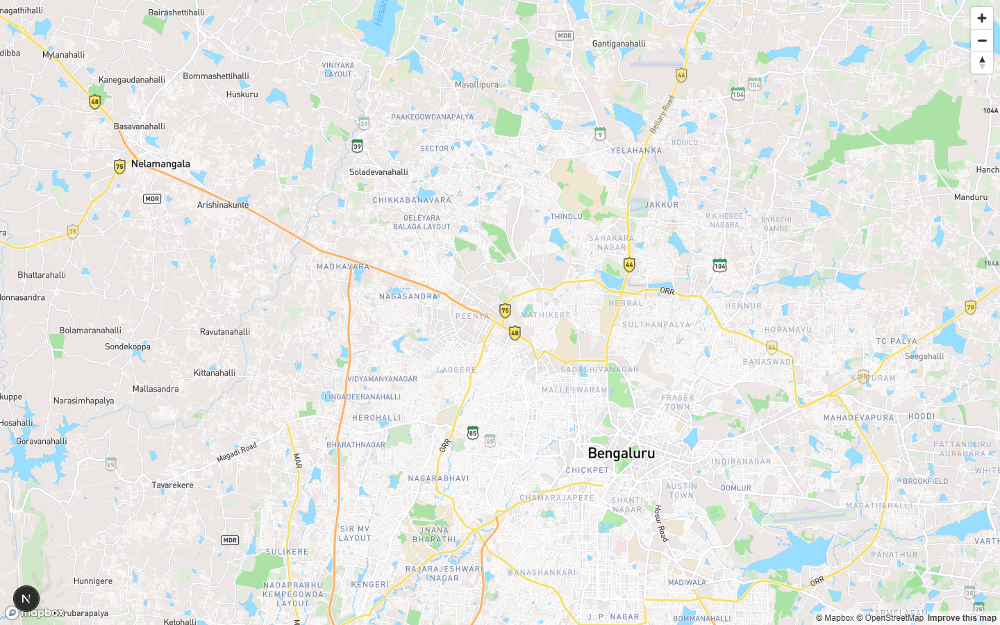
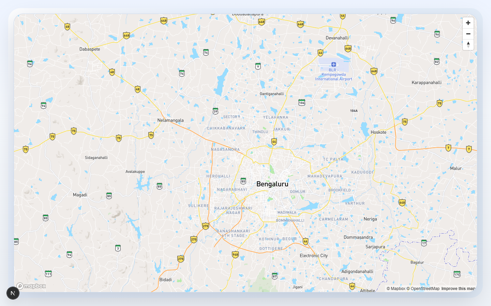

<div align="center">
  
  <h1>P R A V A H</h1>
  <p><strong>Proactive Response And Vehicular Analytics Hub</strong></p>
  <p><em>An Elite AI Traffic Operations Copilot built for the Bengaluru Traffic Police Command Center.</em></p>
  <p><strong>Built by Team VISION — NSUT Delhi</strong></p>
</div>

<br />


## The Problem

Bengaluru's traffic ecosystem is highly volatile. The Bengaluru Traffic Police (BTP) Command Center handles thousands of daily alerts—accidents, civic works, VIP movements, and sudden monsoon deluges. Current systems are **reactive**. By the time officers are deployed, the shockwave of congestion has already cascaded into neighboring corridors, leading to gridlock.

## The Solution: PRAVAH

**PRAVAH** transforms traffic management from a reactive scramble into a **proactive, intelligence-driven operation**. 

Powered by a robust data aggregation pipeline that combines **ASTRAM data with news agent pings and previous monsoon records**, PRAVAH ingests historical and real-time event data to simulate traffic friction, predict secondary congestion spillovers, and generate immediate, actionable tactical advisories using state-of-the-art Generative AI.

### Key Features
- **Multi-Layered Intelligence Dashboard**: Interactive geographic visualization of Chronic Hotspots, Live Incidents, Weather Impacts, Civic Works, and VIP Movements.
- **Kinematic Simulation Engine**: Utilizes the Lighthill-Whitham-Richards (LWR) model to calculate baseline demand, residual capacity, and shockwave speeds to predict bottleneck spillovers.
- **AI Tactical Copilot**: Integrates Groq's high-speed LLMs to instantly generate infrastructural, tactical, and behavioral deployment strategies based on real-time friction data.
- **Live Event Streaming**: Server-Sent Events (SSE) push live incident pings directly to the command dashboard for rapid response.

---

## Dashboard Previews

<div align="center">
  
  
</div>

---

## Tech Stack & Architecture

- **Frontend Application**: React 19, TypeScript, Vite, TailwindCSS v4, React-Leaflet.
- **Backend Simulation Engine**: Node.js, Express, Server-Sent Events (SSE).
- **Data Pipeline**: Custom parsers simulating multi-source event streams.
- **AI / LLM**: Groq SDK (Llama-3.1-8b) for sub-second tactical advisory generation.
- **Deployment**: Configured for Vercel Serverless Functions with dynamic dataset resolution.

### Architecture Overview
1. **Data Ingestion**: The Node backend streams and parses consolidated event records into memory, separating events into historical baselines, planned events, and a predictive queue.
2. **Kinematic Computation**: Real-time traffic events are evaluated to calculate node cascades, ghost queues, and density/velocity impact.
3. **SSE Broadcaster**: Simulated live events are broadcasted over a Server-Sent Events stream to the React frontend.
4. **AI Generation**: When a commander clicks an incident, the localized metrics (density, velocity) are passed to the Groq LLM, which formats a 3-part tactical strategy (Infrastructural, Neighboural Spillover, Behavioural).

---

## Data Sources & Aggregation

To provide a comprehensive operational picture, PRAVAH simulates an intelligence pipeline aggregating multiple inputs:
- **ASTRAM Event Data**: Real-world traffic events categorized by cause (Vehicle Breakdowns, Road Repairs, Protests, Signal Failures).
- **News Agent Pings**: Simulated live-scraped intelligence alerts that highlight spontaneous social disruptions or VIP movements before they are officially reported.
- **Previous Monsoon Records**: Historical meteorological data mapped to vulnerable geographic nodes (e.g., chronic waterlogging hotspots) to proactively predict weather-induced gridlocks.

---

## Local Setup & Installation

### Prerequisites
- Node.js (v20+ recommended)
- A [Groq API Key](https://console.groq.com/keys) for AI strategy generation.

### Installation

1. **Clone the repository**
   ```bash
   git clone https://github.com/sachinkmr-hub/PRAVAH.git
   cd PRAVAH
   ```

2. **Install dependencies**
   ```bash
   npm install
   ```

3. **Configure Environment Variables**
   Create a `.env` file in the root directory:
   ```env
   GROQ_API_KEY=your_groq_api_key_here
   GROQ_MODEL=llama-3.1-8b-instant
   PORT=3000
   ```

4. **Start the Simulation Engine & Frontend**
   ```bash
   npm run dev
   ```
   Open `http://localhost:3000` in your browser.

---

## Deployment

PRAVAH is configured to be deployed on **Vercel** with Serverless Functions.

- The Express backend operates dynamically inside Vercel's Serverless environment via `api/index.ts` and `vercel.json`.
- The dataset is bundled directly into the function limits, with fallback polling for SSE compatibility on serverless constraints.

---

<div align="center">
  <em>Built for the National Hackathon 2026</em>
</div>
